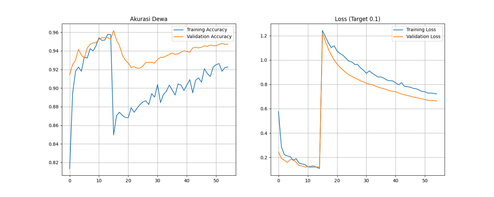

# 🚀 Jagoan Vision T4: Template Training CNN Ultimate


Template kode training **Image Classification** universal yang dirancang khusus untuk memeras performa maksimal **Google Colab (GPU Tesla T4)**.

Dibangun dengan **EfficientNetB0**, fitur **Mixed Precision (Turbo)**, dan **Penyeimbang Data Otomatis**. Cocok buat kamu yang mau bikin model AI canggih (misal: Klasifikasi Ikan, Tanaman, Medis) tapi modal gratisan.

## 🔥 Fitur Unggulan

* **⚡ Mode Turbo (Mixed Precision):** Menggunakan `mixed_float16` untuk mempercepat training hingga 2x lipat di GPU Nvidia T4.
* **🧠 Arsitektur Pro:** Menggunakan Transfer Learning **EfficientNetB0** dengan *custom head* yang kuat (BatchNormalization + Dropout).
* **⚖️ Keadilan Data (Auto-Balancing):** Otomatis menghitung bobot kelas (`class weights`) supaya data yang sedikit tidak dianaktirikan.
* **📂 Detektif Folder:** Otomatis mencari folder kelas di dalam file ZIP, meskipun strukturnya berantakan (folder beranak).
* **🛡️ Training Pintar:** Dilengkapi `EarlyStopping` (Stop kalau sudah pintar) dan `ReduceLROnPlateau` (Rem otomatis saat stuck).
* **📦 Output Sekali Klik:** Otomatis download model `.h5`, kamus `labels.json`, dan grafik performa ke laptop.

## 📊 Bukti Performa (Hasil Training)

Berikut adalah contoh hasil training (Grafik Akurasi & Loss) yang dihasilkan oleh script ini:



*(Grafik di atas menunjukkan model belajar dengan stabil, tidak overfitting, dan mencapai akurasi tinggi dalam waktu singkat)*

## 🛠️ Syarat Pakai

1.  **Akun Google** (Buat akses Google Colab & Drive).
2.  **Dataset:** Sebuah file `.zip` yang isinya folder-folder kelas gambar.
    * Struktur contoh:
        ```
        dataset.zip
        ├── kakap/
        │   ├── 1.jpg
        │   └── ...
        ├── kerapu/
        │   ├── 1.jpg
        │   └── ...
        ```

## 🚀 Cara Penggunaan

1.  **Upload Dataset:** Upload file `dataset.zip` kamu ke Google Drive (misal: di dalam folder bernama `dataset_final`).
2.  **Buka Kode:** Buka file `Training_Script.ipynb` di Google Colab.
3.  **Konfigurasi:** Ubah lokasi file di blok konfigurasi:
    ```python
    PATH_ZIP_DRIVE = '/content/drive/MyDrive/path/ke/dataset_kamu.zip'
    ```
4.  **Gaspol:** Klik menu `Runtime` > `Run all`.
5.  **Selesai:** Script akan otomatis mengekstrak, melatih AI, dan mendownload hasilnya buat kamu.

## 📝 Hasil Output

Setelah training kelar, kamu bakal dapet oleh-oleh:
* `model_klasifikasi_pro.h5`: Otak AI yang sudah terlatih.
* `labels.json`: Kamus label (Penting buat prediksi di Web/App).
* `grafik_keren.png`: Bukti visual akurasi & loss.

## 🤝 Kontribusi

Silakan di-fork, dioprek, atau dikasih bintang kalau bermanfaat!
